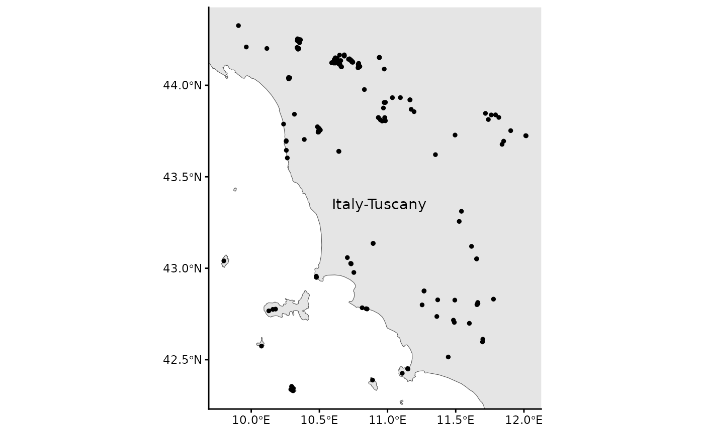
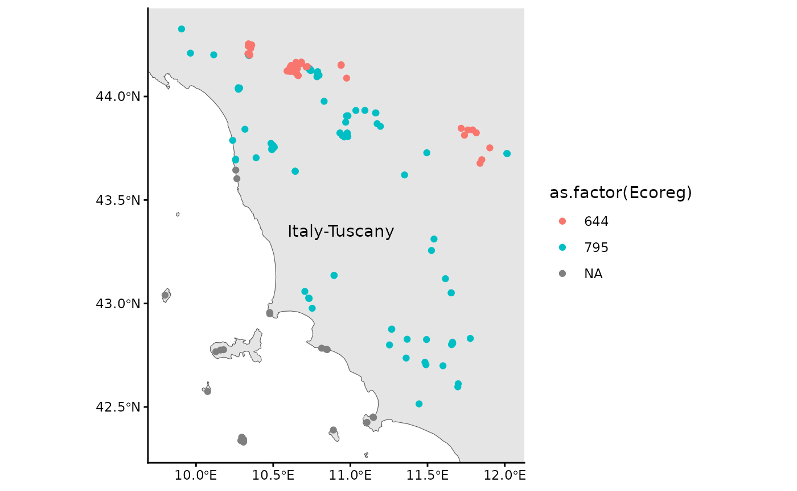

# RESY EUNIS habitat classifications

This vignette illustrates a common use of the package: to classify
European vegetation surveys to **EUNIS habitat types**
([FloraVeg.EU](https://floraveg.eu/); Chytrý et
al. [2024](https://doi.org/10.1111/avsc.12798); European Environment
Agency EUNIS [Website](https://eunis.eea.europa.eu/index.jsp)) according
to the **Expert System (ESy)** of Chytrý et
al. ([2020](https://doi.org/10.1111/avsc.12519)) (see
[FloraVeg.EU](https://floraveg.eu/habitat/)). The function
[`resy_harmonize_eunis()`](https://florian-jansen.github.io/resy/reference/resy_harmonize_eunis.md)
incorporates several functions to collect geographic information about
the vegetation survey like the country, ecoregion, or coastal position.
Furthermore, the format of the coordinates and the taxonomy are checked
and adjusted to the requirements for the expert system (ESy). The
function
[`resy_classify()`](https://florian-jansen.github.io/resy/reference/resy_classify.md)
does the classification of the vegation surveys including the sites
data.

1.  **Prepare the format** of the sites including the right
    **coordination system** and add information like **ecoregion**,
    **country** or if it is on a **coast**.
2.  **Check of taxonomy** of the species data
3.  Evaluation of your vegetation surveys and **assigning EUNIS habitat
    types**
4.  **Present the results**

## Example

The following R packages are required to run the example of this
vignette:

``` r

library(readr)
library(dplyr)
library(ggplot2)
library(sf)
library(RESY)
```

### Load the example data.

The example data include the species data with the vegetation surveys
and the sites data with further information to the location of the
surveys.

First, the vegetation surveys:

``` r

data_species <- read_csv(system.file("extdata", "data_example_species.csv", package = "RESY"), skip = 0)
data_species
#> # A tibble: 3,580 × 3
#>    PlotObservationID cover species                                             
#>    <chr>             <dbl> <chr>                                               
#>  1 HU32                0.1 Dryopteris filix-mas (L.) Schott                    
#>  2 HU32                0.1 Cephalanthera longifolia (L.) Fritsch               
#>  3 HU32                0.5 Prenanthes purpurea L.                              
#>  4 HU32                0.5 Anemone nemorosa L.                                 
#>  5 HU32                0.5 Epipactis helleborine (L.) Crantz subsp. helleborine
#>  6 HU32                0.5 Sorbus aucuparia L. subsp. aucuparia                
#>  7 HU32               87.5 Fagus sylvatica L.                                  
#>  8 HU32                3   Rubus hirtus Waldst. & Kit.                         
#>  9 HU32                3   Abies alba Mill.                                    
#> 10 HU32                3   Oxalis acetosella L.                                
#> # ℹ 3,570 more rows

# clean names with RESY's native cleaner: drops author strings, keeps ranks
data_species$species <- resy_clean_names(data_species$species)
# data_species$species <- vegdata::taxname.removeAuthors(data_species$species)
```

Second, the sites data:

``` r

data_sites <- read_csv(
   system.file("extdata", "data_example_sites.csv", package = "RESY")
   ) |>
   select(-"cover") |>
   st_as_sf(coords = c("Longitude", "Latitude"), crs = 4326)
data_sites
#> Simple feature collection with 200 features and 1 field
#> Geometry type: POINT
#> Dimension:     XY
#> Bounding box:  xmin: 9.809499 ymin: 42.32483 xmax: 12.08963 ymax: 44.32464
#> Geodetic CRS:  WGS 84
#> # A tibble: 200 × 2
#>    PlotObservationID            geometry
#>  * <chr>                     <POINT [°]>
#>  1 JZ37               (9.93798 44.32464)
#>  2 FR49              (11.09287 43.91546)
#>  3 PT45              (11.65339 43.09104)
#>  4 ZH63              (10.53301 43.73897)
#>  5 TF93              (10.40239 44.23978)
#>  6 KG68              (10.40203 44.24087)
#>  7 QJ27               (10.40635 44.2413)
#>  8 JN90              (10.40602 44.24296)
#>  9 ZM18              (10.66071 44.12734)
#> 10 BQ20               (10.6589 44.12456)
#> # ℹ 190 more rows
```

### Map the sites

The vegetation surveys of the example dataset are in Tuscany in Italy.



We see a part of Italy, mainly Tuscany and the Mediterranean or more
specific the Tyrrhenian Sea. The dots are the locations of the
vegetation surveys. Some are on islands.

## Preparation for classification

### Load the expert file

We have to parse the expert file which is the base for every evaluation.
We use `resy_load_expert`.

``` r

parsed <- RESY::resy_load_expert(scheme = "EUNIS")
```

### Apply `resy_harmonize_eunis()`

We prepare the sites and the species data with
[`resy_harmonize_eunis()`](https://florian-jansen.github.io/resy/reference/resy_harmonize_eunis.md).

``` r

outcome <- RESY::resy_harmonize_eunis(
   data = data_sites,
   source_crs = 25832,
   run_taxonomy = TRUE,
   species_data = data_species,
   parsed = parsed,
   run_coast_dunes = TRUE,
   coast_buffer = 5000
   )
#> Warning in RESY::resy_harmonize_eunis(data = data_sites, source_crs = 25832, :
#> "Altitude (m)" is missing. See vignette "Altitude data" and mapsforeurope.org
#> for a raster source.
#> Warning in RESY::resy_harmonize_eunis(data = data_sites, source_crs = 25832, :
#> NA values in "Ecoreg": some sites are outside the ecoregion base map.
#> Warning: attribute variables are assumed to be spatially constant throughout
#> all geometries
#> Warning: attribute variables are assumed to be spatially constant throughout
#> all geometries
outcome_sites <- tibble(outcome$sites)
outcome_species <- tibble(outcome$species_checked)
```

We have three warnings: The column `Altitude (m)` is missing and this
could not be covered by
[`resy_harmonize_eunis()`](https://florian-jansen.github.io/resy/reference/resy_harmonize_eunis.md),
but we provide a `vignette("Get altitude data")`. `NAs` are in the
ecoregions (`Ecoreg`) and country (`Country`) columns. This could be the
vegetation surveys on islands which is not covered by the base map.

### Inspect additional data

Here are the additional information of ecoregions and countries which
were successfully identified:

``` r

outcome_sites
#> # A tibble: 200 × 9
#>    PlotObservationID Coast_EEA Dunes_Bohn Ecoreg Ecoreg_name  Country Country_ID
#>    <chr>             <chr>     <chr>       <dbl> <chr>        <chr>   <chr>     
#>  1 JZ37              N_COAST   N_DUNES       795 Italian scl… Italy   IT        
#>  2 FR49              N_COAST   N_DUNES       795 Italian scl… Italy   IT        
#>  3 PT45              N_COAST   N_DUNES       795 Italian scl… Italy   IT        
#>  4 ZH63              N_COAST   N_DUNES       795 Italian scl… Italy   IT        
#>  5 TF93              N_COAST   N_DUNES       644 Appenine de… Italy   IT        
#>  6 KG68              N_COAST   N_DUNES       644 Appenine de… Italy   IT        
#>  7 QJ27              N_COAST   N_DUNES       644 Appenine de… Italy   IT        
#>  8 JN90              N_COAST   N_DUNES       644 Appenine de… Italy   IT        
#>  9 ZM18              N_COAST   N_DUNES       644 Appenine de… Italy   IT        
#> 10 BQ20              N_COAST   N_DUNES       644 Appenine de… Italy   IT        
#> # ℹ 190 more rows
#> # ℹ 2 more variables: Longitude <dbl>, Latitude <dbl>
```

### Missing info

Let us see which vegetation surveys could not get an ecoregion and
country:

``` r

outcome_sites |>
   filter(is.na(Ecoreg))
#> # A tibble: 23 × 9
#>    PlotObservationID Coast_EEA Dunes_Bohn Ecoreg Ecoreg_name Country Country_ID
#>    <chr>             <chr>     <chr>       <dbl> <chr>       <chr>   <chr>     
#>  1 OR48              MED_COAST N_DUNES        NA NA          Italy   IT        
#>  2 EQ56              MED_COAST N_DUNES        NA NA          Italy   IT        
#>  3 IS69              MED_COAST N_DUNES        NA NA          Italy   IT        
#>  4 JP48              MED_COAST N_DUNES        NA NA          Italy   IT        
#>  5 MF17              MED_COAST N_DUNES        NA NA          Italy   IT        
#>  6 SA50              MED_COAST N_DUNES        NA NA          Italy   IT        
#>  7 DR59              MED_COAST N_DUNES        NA NA          Italy   IT        
#>  8 QI21              MED_COAST N_DUNES        NA NA          Italy   IT        
#>  9 PK58              MED_COAST N_DUNES        NA NA          Italy   IT        
#> 10 OY37              MED_COAST N_DUNES        NA NA          Italy   IT        
#> # ℹ 13 more rows
#> # ℹ 2 more variables: Longitude <dbl>, Latitude <dbl>
```

Species on the coast (‘MED_COAST’) often have `NAs` for ecoregion and
country. This has to be corrected by yourself.

Here is the updated map with ecoregions as differetn colors



### Checked species names

Let’s have a look on the checked and transformed species names. There
are for example no author names anymore:

``` r

outcome_species
#> # A tibble: 1,006 × 3
#>    TaxonName                                matched canonical                  
#>    <chr>                                    <lgl>   <chr>                      
#>  1 Dryopteris filix-mas                     TRUE    Dryopteris filix-mas aggr. 
#>  2 Cephalanthera longifolia                 TRUE    Cephalanthera longifolia   
#>  3 Prenanthes purpurea                      TRUE    Prenanthes purpurea        
#>  4 Anemone nemorosa                         TRUE    Anemone nemorosa           
#>  5 Epipactis helleborine subsp. helleborine TRUE    Epipactis helleborine aggr.
#>  6 Sorbus aucuparia subsp. aucuparia        TRUE    Sorbus aucuparia           
#>  7 Fagus sylvatica                          TRUE    Fagus sylvatica            
#>  8 Rubus hirtus                             TRUE    Rubus fruticosus aggr.     
#>  9 Abies alba                               TRUE    Abies alba                 
#> 10 Oxalis acetosella                        TRUE    Oxalis acetosella          
#> # ℹ 996 more rows
```

``` r

outcome_species2 <- data_species |>
  left_join(outcome_species, by = c("species" = "TaxonName")) |>
  select(PlotObservationID, canonical, cover) |>
  rename(TaxonName = canonical, Cover_Perc = cover)
```

## Classify the vegetation surveys

### Apply `resy_classify()`

Now, you can classify your vegetation surveys (`obs`) which includes
sites data (`header`).

``` r

res <- RESY::resy_classify(
  obs = outcome_species2,
  header = outcome_sites,
  scheme = "EUNIS"
  )
#> Step 5.1  Number of conditions with number of species of a group: 15
#> Step 5.2  Number of conditions with minimum number of species: 127
#> Step 5.3  Number of conditions with sum of square rooted Cover_Perc of species: 140
#> Step 5.4  Number of conditions with total Cover_Perc of the group: 0
#> Step 5.5  Number of conditions with total Cover_Perc of all other species: 1
#>           Number of conditions with total Cover_Perc of all other species except those on the left-hand side: 32
#>           Number of conditions with $05, $25 etc.: 4
#> Step 5.6  Number of conditions with maximum cover of the group: 81
#> Step 5.7  Number of conditions with single species, header levels (e.g. country names): 114
#> Step 5.8  Number of conditions with maximum Cover_Perc in plot: 1
#>           Number of conditions with maximum Cover_Perc in plot EXCEPT species of target group: 0
#> Step 5.9  Number of T$ NON conditions: 140
#> Step 5.10  Header conditions with numeric values: 4
#>   Header conditions with character values: 4
#> adapt conditions 2026-07-22 20:33:47.202969
#> classification from here on 2026-07-22 20:33:47.338033
```

### Inspect the results

#### Long table of candidates for all plots

You can see that the plot AM30 was classified with two EUNIS habitat
types, but with different priorities.

``` r

cand <- resy_candidates(res, top_n = 3) |>
  tibble()
cand
#> # A tibble: 321 × 4
#>    plot_id type  priority priority_rank
#>    <chr>   <chr> <ord>            <int>
#>  1 AE28    R     1                    1
#>  2 AM30    T     3                    3
#>  3 AM30    T17   4                    4
#>  4 AN57    T     3                    3
#>  5 BE71    T     3                    3
#>  6 BF83    P     1                    1
#>  7 BF83    P3b   2                    2
#>  8 BK34    R     1                    1
#>  9 BK70    P     1                    1
#> 10 BK70    P3b   2                    2
#> # ℹ 311 more rows
```

#### Plot-level details

[`resy_eval_plot()`](https://florian-jansen.github.io/resy/reference/resy_eval_plot.md)
prints the full evidence for one plot: which species matched, which
group conditions fired, and which vegetation-type formulas evaluated to
`TRUE`.

``` r

# Replace "AN57" with a PlotObservationID present in your data
resy_eval_plot(res, p = "AM30")
#> Plant observations for plot AM30 :
#>     PlotObservationID                  TaxonName
#>                <char>                     <char>
#>  1:              AM30               Luzula nivea
#>  2:              AM30          Cicerbita muralis
#>  3:              AM30          Hieracium murorum
#>  4:              AM30       Veronica urticifolia
#>  5:              AM30        Acer pseudoplatanus
#>  6:              AM30           Sorbus aucuparia
#>  7:              AM30                 Abies alba
#>  8:              AM30         Solidago virgaurea
#>  9:              AM30 Dryopteris filix-mas aggr.
#> 10:              AM30      Athyrium filix-femina
#> 11:              AM30            Fagus sylvatica
#> 12:              AM30        Prenanthes purpurea
#>                                                                                                                                                                                                                  group_names
#>                                                                                                                                                                                                                       <char>
#>  1:                                                                                                                                                                       Hemicryptophytes | +11 Acidophilous-forest-species
#>  2:                                             Hemicryptophytes | +04 R55-Lowland-moist-or-wet-tall-herb-and-fern-fringe | +04 R57-Herbaceous-forest-clearing-vegetation | +12 Grassland-species | +12 Synanthropic-species
#>  3:                                                                                                                     Chamaephytes | +04 R52-Forest-fringe-of-acidic-nutrient-poor-soils | +11 Acidophilous-forest-species
#>  4:                                                                                                                                                                Hemicryptophytes | +11 Eutrophic-deciduous-forest-species
#>  5:                                                                               Native-broadleaf-trees | Native-trees | Noble-hardwood-trees | Noble-hardwood-trees-ravine-specialists | Ravine-forest-specialists | Trees
#>  6:                                                     Forest-clearing-trees-and-shrubs | Native-broadleaf-trees | Native-trees | Shrubs | Temperate-deciduous-shrubs | Temperate-submediterranean-deciduous-shrubs | Trees
#>  7:                                                                                                                                                            Native-conifer-trees | Native-trees | Temperate-Abies | Trees
#>  8: Hemicryptophytes | +03 U2a-Siliceous-high-mountain-scree | +03 U2b-Siliceous-lowland-scree | +04 R52-Forest-fringe-of-acidic-nutrient-poor-soils | +12 Grassland-species | +12 Inland-sparsely-vegetated-habitat-species
#>  9:                                                                                                                          +04 R55-Lowland-moist-or-wet-tall-herb-and-fern-fringe | +11 Eutrophic-deciduous-forest-species
#> 10:                                                                                                                                                                                                                     <NA>
#> 11:                                                                                                                                               Fagus-sylvatica-orientalis | Native-broadleaf-trees | Native-trees | Trees
#> 12:                                                                                                                                                                Hemicryptophytes | +11 Eutrophic-deciduous-forest-species
#>     Cover_Perc
#>          <num>
#>  1:        0.1
#>  2:        0.1
#>  3:        0.5
#>  4:        0.5
#>  5:        0.5
#>  6:        0.5
#>  7:        0.5
#>  8:        0.5
#>  9:        0.5
#> 10:        0.5
#> 11:       87.5
#> 12:        3.0
#> Possible types of plot "AM30" (60): R
#> Priorities of these types: 1 
#> Classified as: R
```

#### Vegetation type details

[`resy_eval_type()`](https://florian-jansen.github.io/resy/reference/resy_eval_type.md)
shows conditions of a type which is evaluated.

``` r

resy_eval_type(res, t = "R1A")
#> R1A   Semi-dry perennial calcareous grassland (meadow steppe)
#> 
#> ((<##Q +04 R1A-Semi-dry-perennial-calcareous-grassland GR NON ##Q +04 R1A-Semi-dry-perennial-calcareous-grassland> AND <#03 +04 R1A-Semi-dry-perennial-calcareous-grassland>) AND <#T$ GR 30>) NOT <#TC Trees GR 15> OR <TC Shrubs GR 15>
#> 
#> ((col217 & col218) & col219) &! col4 | col5
#> 
#>     expressions                                                                                                   
#> 217 ##Q +04 R1A-Semi-dry-perennial-calcareous-grassland GR NON ##Q +04 R1A-Semi-dry-perennial-calcareous-grassland
#> 218 #03 +04 R1A-Semi-dry-perennial-calcareous-grassland                                                           
#> 219 #T$ GR 30                                                                                                     
#> 4   #TC Trees GR 15                                                                                               
#> 5   TC Shrubs GR 15
```

#### Print classification hierarchy

We can see all habitat types at once:

``` r

tree_filled <- resy_expert_tree(parsed, fill = TRUE)
print(tree_filled)
#> <resy_expert_tree> 339 node(s), 9 top-level, 38 synthesised group(s)
#> MA Coastal saltmarshes
#>   MA2
#>     MA211 Arctic coastal saltmarsh
#>     MA22
#>       MA221 Atlantic saltmarsh driftline
#>       MA222 Atlantic upper saltmarsh
#>       MA223 Atlantic upper-mid saltmarsh and saline and brackish reed, rush and sedge bed
#>       MA224 Atlantic mid-low saltmarsh
#>       MA225 Atlantic pioneer saltmarsh
#>     MA232 Baltic coastal meadow
#>     MA241 Black Sea littoral saltmarsh
#>     MA25
#>       MA251 Mediterranean upper saltmarsh
#>       MA252 Mediterranean upper-mid saltmarsh and saline and brackish reed, rush and sedge bed
#>       MA253 Mediterranean mid-low saltmarsh
#>   MAa Angiosperm vegetation in the marine littoral zone
#> N Coastal sand and cliff habitats
#>   N1
#>     N11 Atlantic, Baltic and Arctic sand beach
#>     N12 Mediterranean and Black Sea sand beach
#>     N13 Atlantic and Baltic shifting coastal dune
#>     N14 Mediterranean, Macaronesian and Black Sea shifting coastal dune
#>     N15 Atlantic and Baltic coastal dune grassland (grey dune)
#>       N15! Atlantic and Baltic coastal dune grassland (grey dune)
#>         N15!! Atlantic and Baltic coastal dune grassland (grey dune)
#>     N16 Mediterranean and Macaronesian coastal dune grassland (grey dune)
#>       N16! Mediterranean and Macaronesian coastal dune grassland (grey dune)
#>         N16!! Mediterranean and Macaronesian coastal dune grassland (grey dune)
#>     N17 Black Sea coastal dune grassland (grey dune)
#>       N17! Black Sea coastal dune grassland (grey dune)
#>         N17!! Black Sea coastal dune grassland (grey dune)
#>     N18 Atlantic and Baltic coastal Empetrum heath
#>     N19 Atlantic coastal Calluna and Ulex heath
#>     N1A Atlantic and Baltic coastal dune scrub
#>     N1B Mediterranean and Black Sea coastal dune scrub
#>     N1C Macaronesian coastal dune scrub
#>     N1D Atlantic and Baltic broad-leaved coastal dune forest
#>     N1E Black Sea broad-leaved coastal dune forest
#>     N1F Baltic coniferous coastal dune forest
#>     N1G Mediterranean coniferous coastal dune forest
#>     N1H Atlantic and Baltic moist and wet dune slack
#>     N1J Mediterranean and Black Sea moist and wet dune slack
#>   N2
#>     N21 Atlantic, Baltic and Arctic coastal shingle beach
#>     N22 Mediterranean and Black Sea coastal shingle beach
#>   N3
#>     N31 Atlantic and Baltic rocky sea cliff and shore
#>       N31! Atlantic and Baltic rocky sea cliff and shore
#>     N32 Mediterranean and Black Sea rocky sea cliff and shore
#>     N33 Macaronesian rocky sea cliff and shore
#>     N34 Atlantic and Baltic soft sea cliff
#>     N35 Mediterranean and Black Sea soft sea cliff
#> P Surface waters
#>   P2N Spring
#>   P3
#>     P3a Brackish-water vegetation
#>     P3b Fresh-water small pleustophyte vegetation
#>     P3c Fresh-water large pleustophyte vegetation
#>     P3d Fresh-water submerged vegetation
#>     P3e Fresh-water nymphaeid vegetation
#>     P3f Oligotrophic-water vegetation
#>     P3g Dystrophic-water vegetation
#>     P3h Stonewort vegetation
#> Q
#>   Q1
#>     Q11 Raised bog
#>     Q12 Blanket bog
#>   Q2
#>     Q21 Oceanic valley mire
#>     Q22 Poor fen
#>     Q23 Relict mire of Mediterranean mountains
#>     Q24 Intermediate fen and soft-water spring mire
#>     Q25 Non-calcareous quaking mire
#>   Q31 Palsa mire
#>   Q4
#>     Q41 Alkaline, calcareous, carbonate-rich small-sedge spring fen
#>     Q42 Extremely rich moss-sedge fen
#>     Q43 Tall-sedge base-rich fen
#>     Q44 Calcareous quaking mire
#>     Q45 Arctic-alpine rich fen
#>     Q46 Carpathian travertine fen with halophytes
#>   Q5
#>     Q51 Tall-helophyte bed
#>     Q52 Small-helophyte bed
#>     Q53 Tall-sedge bed
#>     Q54 Inland saline or brackish helophyte bed
#>   Q6
#>     Q61 Periodically exposed shore with stable, eutrophic sediments with pioneer or ephemeral vegetation
#>     Q62 Periodically exposed shore with stable, mesotrophic sediments with pioneer or ephemeral vegetation
#>     Q63 Periodically exposed saline shore with pioneer or ephemeral vegetation
#>   Qa Mires
#>   Qb Wetlands
#> R Grasslands
#>   R1
#>     R11 Pannonian and Pontic sandy steppe
#>       R11! Pannonian and Pontic sandy steppe
#>     R12 Cryptogam- and annual-dominated vegetation on siliceous rock outcrops
#>     R13 Cryptogam- and annual-dominated vegetation on calcareous and ultramafic rock outcrops
#>     R14 Perennial rocky grassland of the Italian Peninsula
#>     R15 Continental dry rocky steppic grassland and dwarf scrub on chalk outcrops
#>     R16 Perennial rocky grassland of Central and South-Eastern Europe
#>     R17 Heavy-metal dry grassland of the Balkans
#>     R18 Perennial rocky calcareous grassland of subatlantic-submediterranean Europe
#>     R19 Dry steppic submediterranean pasture of the Amphi-Adriatic region
#>     R1A Semi-dry perennial calcareous grassland (meadow steppe)
#>     R1B Continental dry grassland (true steppe)
#>       R1B! Continental dry grassland (true steppe)
#>     R1C Desert steppe
#>     R1D Mediterranean closely grazed dry grassland
#>     R1E Mediterranean tall perennial dry grassland
#>       R1E! Mediterranean tall perennial dry grassland
#>     R1F Mediterranean annual-rich dry grassland
#>     R1G Iberian oromediterranean siliceous dry grassland
#>       R1G! Iberian oromediterranean siliceous dry grassland
#>     R1H Iberian oromediterranean basiphilous dry grassland
#>       R1H! Iberian oromediterranean basiphilous dry grassland
#>     R1J Cyrno-Sardean oromediterranean siliceous dry grassland
#>       R1J! Cyrno-Sardean oromediterranean siliceous dry grassland
#>     R1K Balkan and Anatolian oromediterranean dry grassland
#>       R1K! Balkan and Anatolian oromediterranean dry grassland
#>     R1L Madeiran oromediterranean siliceous dry grassland
#>       R1L! Madeiran oromediterranean siliceous dry grassland
#>     R1M Lowland to montane, dry to mesic grassland usually dominated by Nardus stricta
#>     R1N Open Iberian supramediterranean dry acid and neutral grassland
#>       R1N! Open Iberian supramediterranean dry acid and neutral grassland
#>     R1P Oceanic to subcontinental inland sand grassland on dry acid and neutral soils
#>     R1Q Inland sanddrift and dune with siliceous grassland
#>       R1Q! Inland sanddrift and dune with siliceous grassland
#>     R1R Mediterranean to Atlantic open, dry, acid and neutral grassland
#>     R1S Heavy-metal grassland in Western and Central Europe
#>     R1T Azorean open, dry, acid to neutral grassland
#>   R2
#>     R21 Mesic permanent pasture of lowlands and mountains
#>     R22 Low and medium altitude hay meadow
#>     R23 Mountain hay meadow
#>       R23! Mountain hay meadow
#>     R24 Iberian summer pasture (vallicar)
#>       R24! Iberian summer pasture (vallicar)
#>   R3
#>     R31 Mediterranean tall humid inland grassland
#>     R32 Mediterranean short moist grassland of lowlands
#>     R33 Mediterranean short moist grassland of mountains
#>     R34 Submediterranean moist meadow
#>     R35 Moist or wet mesotrophic to eutrophic hay meadow
#>     R36 Moist or wet mesotrophic to eutrophic pasture
#>     R37 Temperate and boreal moist or wet oligotrophic grassland
#>   R4
#>     R41 Snow-bed vegetation
#>       R41! Snow-bed vegetation
#>     R42 Boreal and Arctic acidophilous alpine grassland
#>       R42! Boreal and Arctic acidophilous alpine grassland
#>     R43 Temperate acidophilous alpine grassland
#>       R43! Temperate acidophilous alpine grassland
#>     R44 Arctic-alpine calcareous grassland
#>     R45 Alpine and subalpine calcareous grassland of the Balkans and Apennines
#>       R45! Alpine and subalpine calcareous grassland of the Balkans and Apennines
#>   R5
#>     R51 Thermophilous forest fringe of base-rich soils
#>       R51! Thermophilous forest fringe of base-rich soils
#>     R52 Forest fringe of acidic nutrient-poor soils
#>       R52! Forest fringe of acidic nutrient-poor soils
#>     R53 Macaronesian thermophilous forest fringe
#>       R53! Macaronesian thermophilous forest fringe
#>     R54 Pteridium aquilinum vegetation
#>     R55 Lowland moist or wet tall-herb and fern fringe
#>     R56 Montane to subalpine moist or wet tall-herb and fern fringe
#>     R57 Herbaceous forest clearing vegetation
#>   R6
#>     R61 Mediterranean inland salt steppe
#>     R62 Continental inland salt steppe
#>     R63 Temperate inland salt marsh
#>     R64 Semi-desert salt pan
#>     R65 Continental subsaline alluvial pasture and meadow
#> S
#>   S1
#>     S11 Shrub tundra
#>     S12 Moss and lichen tundra
#>   S2
#>     S21 Subarctic and alpine dwarf Salix scrub
#>     S22 Alpine and subalpine ericoid heath
#>     S23 Alpine and subalpine Juniperus scrub
#>     S24 Subalpine genistoid scrub of the Amphi-Adriatic region
#>     S25 Subalpine and subarctic deciduous scrub
#>     S26 Subalpine Pinus mugo scrub
#>       S26! Subalpine Pinus mugo scrub
#>   S3
#>     S31 Lowland to montane temperate and submediterranean Juniperus scrub
#>     S32 Temperate Rubus scrub
#>     S33 Lowland to montane temperate and submediterranean genistoid scrub
#>     S34 Balkan-Anatolian submontane genistoid scrub
#>     S35 Temperate and submediterranean thorn scrub
#>     S36 Low steppic scrub
#>     S37 Corylus avellana scrub
#>     S38 Temperate forest clearing scrub
#>   S4
#>     S41 Wet heath
#>     S42 Dry heath
#>     S43 Macaronesian heath
#>   S5
#>     S51 Mediterranean maquis and arborescent matorral
#> ... (139 more node(s) not shown; increase `max`)
```

## References

Chytrý M, Řezníčková M, Novotný P et
al. ([2024](https://doi.org/10.1111/avsc.12798)) FloraVeg.EU – an online
database of European vegetation, habitats and flora. – *Applied
Vegetation Science* 27, e12798. <https://doi.org/10.1111/avsc.12798>

Bruelheide H, Tichý L, Chytrý M, Jansen F
([2021](https://doi.org/10.1111/avsc.12562)) Implementing the formal
language of the vegetation classification expert systems (ESy) in the
statistical computing environment R. – *Applied Vegetation Science* 24,
e12562 <https://doi.org/10.1111/avsc.12562>

Chytrý M, Tichý L, Hennekens SM et
al. ([2020](https://doi.org/10.1111/avsc.12519)) EUNIS Habitat
Classification: expert system, characteristic species combinations and
distribution maps of European habitats. – *Applied Vegetation Science*
23, 648–675. <https://doi.org/10.1111/avsc.12519>

Mucina L, Bültmann H, Dierßen K et
al. ([2016](https://doi.org/10.1111/avsc.12257)) Vegetation of Europe:
hierarchical floristic classification system of vascular plant,
bryophyte, lichen, and algal communities. – *Applied Vegetation Science*
19(Suppl. 1), 3–264.<https://doi.org/10.1111/avsc.12257>
