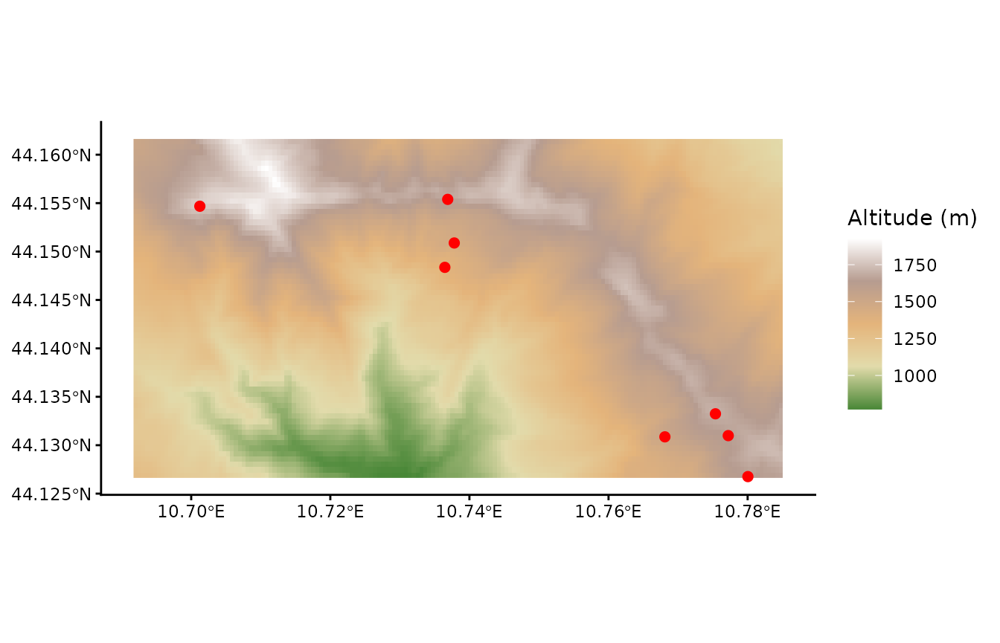

# Get altitude data

This vignette illustrates how to obtain altitude data (column “Altitude
(m)”) for use with the wrapper function `resy_classify`. Because the
altitude dataset is too large to be included in the package, you need to
download it separately.

``` r

library(dplyr)
library(ggplot2)
library(here)
library(sf)
library(terra)
library(tidyterra)
```

## Example

First, we illustrate the altitude data for our example dataset.

### Load data

Load the altitude data for a part of our example.

``` r

altitude <- terra::rast(
  system.file("extdata", "data_example_altitude.tif", package = "RESY")
)
altitude
#> class       : SpatRaster
#> size        : 63, 168, 1  (nrow, ncol, nlyr)
#> resolution  : 0.0005555556, 0.0005555556  (x, y)
#> extent      : 10.69171, 10.78504, 44.12662, 44.16162  (xmin, xmax, ymin, ymax)
#> coord. ref. : lon/lat WGS 84 (EPSG:4326)
#> source      : data_example_altitude.tif
#> name        : eurodem
#> min value   :     771
#> max value   :    1927
```

Load example plots which are part of the above altitute raster file.

``` r

data_sites <- readr::read_csv(
  system.file("extdata", "data_example_sites.csv", package = "RESY"),
  show_col_types = FALSE
) |>
  dplyr::select(PlotObservationID, Longitude, Latitude) |>
  sf::st_as_sf(coords = c("Longitude", "Latitude"), crs = 4326) |>
  sf::st_transform(terra::crs(altitude)) |>
  sf::st_crop(sf::st_bbox(altitude)) # for this example we use a subset of the total map
```

We can show the map with altitude data and the example plots (red).

``` r

ggplot() +
  tidyterra::geom_spatraster(data = altitude) +
  tidyterra::scale_fill_whitebox_c(
    palette = "high_relief",
    na.value = "lightblue"
    ) +
  geom_sf(data = data_sites, color = "red", size = 2) +
  labs(fill = "Altitude (m)") +
  theme_classic()
```



© EuroGeographics 2026, Istituto Geografico Militare (IGM), Italy;
[Licence](https://www.mapsforeurope.org/licence)

### Get ‘Altitude (m)’

``` r

data_sites <- data_sites |>
  mutate(
    "Altitude (m)" = terra::extract(altitude, terra::vect(data_sites))$eurodem
    )
data_sites
#> Simple feature collection with 8 features and 2 fields
#> Geometry type: POINT
#> Dimension:     XY
#> Bounding box:  xmin: 10.70124 ymin: 44.12676 xmax: 10.78004 ymax: 44.15539
#> Geodetic CRS:  WGS 84
#> # A tibble: 8 × 3
#>   PlotObservationID            geometry `Altitude (m)`
#> * <chr>                     <POINT [°]>          <dbl>
#> 1 VG30              (10.73782 44.15088)           1434
#> 2 JW66              (10.73688 44.15539)           1657
#> 3 MJ41              (10.73647 44.14837)           1355
#> 4 WH80              (10.70124 44.15468)           1765
#> 5 DS96              (10.78004 44.12676)           1645
#> 6 SB81              (10.77721 44.13099)           1640
#> 7 JU84               (10.7681 44.13086)           1507
#> 8 KM11              (10.77537 44.13324)           1690
```

## Crop your own altitude data

Download the elevation data from EuroDEM (European Digital Elevation
Model) from <https://www.mapsforeurope.org/datasets/euro-dem> which is
from EuroGeographics and the project is cofounded by the European Union.

### Load altitude data

Save EuroDEM data in the data folder of your R project. From there, you
can load the raster file.

``` r

# altitude <- terra::rast(
#   here::here("data", "euro-dem-tif", "data", "eurodem.tif")
# )
```

EuroDEM is in arcseconds and we have to rescale it to degrees.

``` r

# e <- terra::ext(altitude)
# terra::ext(altitude) <- terra::ext(
#   e[1] / 3600, e[2] / 3600, e[3] / 3600, e[4] / 3600
# )
```

The altitude data needs the right coordination system: EPSG:4258 -
ETRS89 (European Terrestrial Reference System 1989) in degrees.

``` r

# terra::crs(altitude) <- "EPSG:4258"  # geographic ETRS89, degrees
```

Get an overview of the status of the EuroDEM data.

``` r

# altitude
```

### Load example sites

Now, we can load the sites data and transform it to an sf object and
align the CRS to the raster altitude data.

``` r

# data_sites <- readr::read_csv(
#   here::here("data", "data_example_sites.csv", package = "RESY"),
#   show_col_types = FALSE
# ) |>
#   sf::st_as_sf(coords = c("Longitude", "Latitude"), crs = 4326) |>
#   sf::st_transform(terra::crs(altitude))
```

### Crop to your area

We can crop the elevation map to the area covered by our vegetation
relevés.

``` r

# altitude_cropped <- data_sites |>
#   sf::st_buffer(0.5) |> # degrees now, ~50 km
#   sf::st_bbox() |>
#   terra::crop(x = altitude, y = _) |>
#   terra::project("EPSG:4326")
```

Save the cropped and therefore smaller altitude data for a latter use.

``` r

# terra::writeRaster(
#   altitude_cropped,
#   here::here("data", "data_example_altitude.tif"),
#   overwrite = TRUE
# )
```

Now you can go on with the above [example](#example) and [get altitude
data](#get-altitude).
