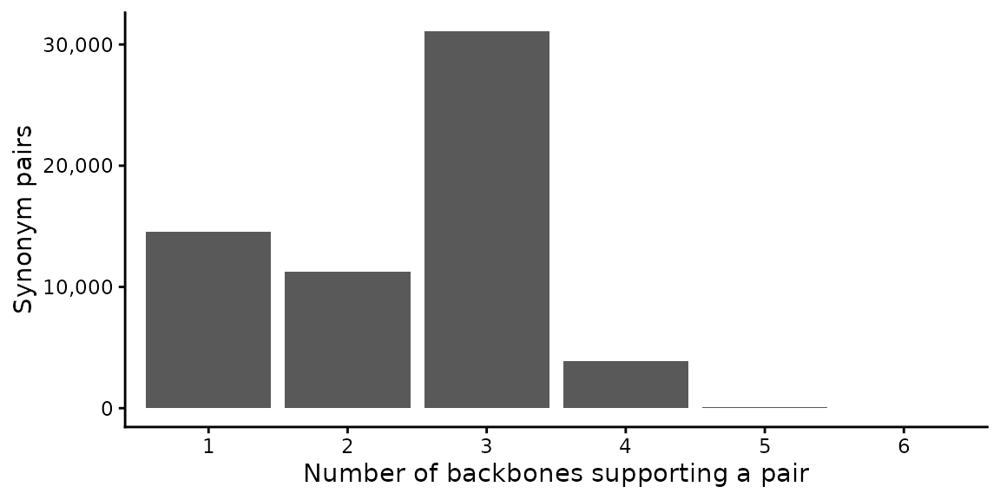

# RESY taxonomy

``` r

library(RESY)
library(ggplot2)
```

## Why a separate step

[`resy_classify()`](https://florian-jansen.github.io/resy/reference/resy_classify.md)
is taxonomy-agnostic: it classifies the species names it is given,
matching them against the vocabulary of the expert system. It works best
when the names in your plot data already match that vocabulary, which is
the case for data drawn from the European Vegetation Archive.

Plot data named under a general backbone (GBIF, World Flora Online,
POWO, Euro+Med, a national checklist) will often use different strings
for the same taxon: an accepted-name synonym, an author citation, or a
spelling variant. Those names have to be harmonised to the expert
vocabulary first. RESY treats this as a separate step, so you can check
the taxonomic decisions before they affect a classification.

The workflow is: resolve names, inspect the result, then classify.

## The shipped synonym table

RESY ships a synonym table that maps alternate species names to the
canonical name used by the EUNIS-ESy expert system. It pools synonymy
from six backbones (Euro+Med, WFO, GBIF, Catalogue of Life, ITIS, NCBI),
so a name coming from any of them can resolve without you having to say
which backbone it came from.

``` r

syn <- resy_read_synonyms()
nrow(syn)
#> [1] 60911
head(syn)
#>                    synonym          esy_canonical       source
#> 1       Abelmoschus bammia Abelmoschus esculentus col;gbif;wfo
#> 2  Abelmoschus longifolius Abelmoschus esculentus col;gbif;wfo
#> 3      Abelmoschus praecox Abelmoschus esculentus col;gbif;wfo
#> 4 Abelmoschus tuberculatus Abelmoschus esculentus col;gbif;wfo
#> 5          Hibiscus bammia Abelmoschus esculentus col;gbif;wfo
#> 6   Hibiscus hispidissimus Abelmoschus esculentus col;gbif;wfo
```

Each row is one alternate spelling (`synonym`), the canonical ESy name
it resolves to (`esy_canonical`), and the backbone(s) that support the
pairing (`source`).

A pair is listed under every backbone that supports it, so the counts
per backbone add up to more than the number of rows.

``` r

per_backbone <- table(unlist(strsplit(syn$source, ";", fixed = TRUE)))
support <- data.frame(
  backbone = names(per_backbone),
  pairs    = as.integer(per_backbone),
  share    = round(100 * as.integer(per_backbone) / nrow(syn), 1)
)
support <- support[order(-support$pairs), ]

knitr::kable(
  support,
  row.names   = FALSE,
  col.names   = c("Backbone", "Synonym pairs", "% of table"),
  format.args = list(big.mark = ",")
)
```

| Backbone | Synonym pairs | % of table |
|:---------|--------------:|-----------:|
| gbif     |        50,877 |       83.5 |
| wfo      |        44,678 |       73.3 |
| col      |        44,004 |       72.2 |
| itis     |         3,923 |        6.4 |
| euromed  |         2,200 |        3.6 |
| ncbi     |           812 |        1.3 |

Most pairs are supported by more than one backbone:

``` r

per_pair <- table(lengths(strsplit(syn$source, ";", fixed = TRUE)))
support_n <- data.frame(
  n_backbones = names(per_pair),
  pairs       = as.integer(per_pair)
)

ggplot(support_n, aes(x = n_backbones, y = pairs)) +
  geom_col() +
  scale_y_continuous(labels = function(x) format(x, big.mark = ",")) +
  labs(x = "Number of backbones supporting a pair", y = "Synonym pairs") +
  theme_classic()
```



## Resolve names

[`resy_resolve_taxa()`](https://florian-jansen.github.io/resy/reference/resy_resolve_taxa.md)
maps a column of names to the canonical vocabulary. A name already equal
to a canonical name resolves to itself (`"exact"`); otherwise it is
looked up in the synonym table (`"synonym"`). A name that matches
neither is matched again with its author citation removed by
[`resy_clean_names()`](https://florian-jansen.github.io/resy/reference/resy_clean_names.md)
(`"cleaned_exact"`, `"cleaned_synonym"`); the name in your data is left
as it is. A name that still matches nothing stays `NA` and is flagged
`"unresolved"`. Nothing is ever replaced with a best guess.

``` r

plots <- data.frame(
  TaxonName = c(
    "Hibiscus praecox",        # a synonym in the shipped table
    "Abelmoschus longifolius",  # another synonym
    "Fagus sylvatica",          # already a canonical name
    "Anemone nemorosa L.",      # canonical name with an author citation
    "Not a real species 123"    # resolves to nothing
  ),
  stringsAsFactors = FALSE
)

resolved <- resy_resolve_taxa(plots, species_col = "TaxonName")
resolved
#>                 TaxonName              canonical taxon_confidence
#> 1        Hibiscus praecox Abelmoschus esculentus          synonym
#> 2 Abelmoschus longifolius Abelmoschus esculentus          synonym
#> 3         Fagus sylvatica        Fagus sylvatica            exact
#> 4     Anemone nemorosa L.       Anemone nemorosa    cleaned_exact
#> 5  Not a real species 123                   <NA>       unresolved
```

[`resy_summarize_taxa()`](https://florian-jansen.github.io/resy/reference/resy_summarize_taxa.md)
reports how many names resolved, the breakdown by confidence, and the
distinct names that stayed unresolved.

``` r

resy_summarize_taxa(resolved, species_col = "TaxonName")
#> $n
#> [1] 5
#> 
#> $resolved
#> [1] 4
#> 
#> $unresolved
#> [1] 1
#> 
#> $by_confidence
#>      confidence n prop
#> 1 cleaned_exact 1  0.2
#> 2         exact 1  0.2
#> 3       synonym 2  0.4
#> 4    unresolved 1  0.2
#> 
#> $unresolved_taxa
#> [1] "Not a real species 123"
```

Unresolved names can be fixed by correcting a spelling, adding a row to
your own crosswalk, or leaving them out.

## Bring your own crosswalk

[`resy_resolve_taxa()`](https://florian-jansen.github.io/resy/reference/resy_resolve_taxa.md)
also accepts your own crosswalk, with three columns: `synonym`,
`esy_canonical`, and `source`. A small example ships with the package.

``` r

cw_path <- system.file("extdata", "example_crosswalk.csv", package = "RESY")
crosswalk <- resy_read_synonyms(cw_path)
crosswalk
#>               synonym    esy_canonical               source
#> 1     Fagus silvatica  Fagus sylvatica orthographic variant
#> 2    Pinus silvestris Pinus sylvestris orthographic variant
#> 3     Abies pectinata       Abies alba    taxonomic synonym
#> 4   Nardus stricta L.   Nardus stricta      author citation
#> 5 Anemone nemorosa L. Anemone nemorosa      author citation
```

Pass it to `synonyms=`, and give the target names to `canonical=` so
resolution uses your table alone:

``` r

my_plots <- data.frame(
  TaxonName = c("Fagus silvatica", "Abies pectinata", "Quercus robur"),
  stringsAsFactors = FALSE
)

resy_resolve_taxa(
  my_plots,
  species_col = "TaxonName",
  synonyms    = crosswalk,
  canonical   = unique(crosswalk$esy_canonical)
)
#>         TaxonName       canonical taxon_confidence
#> 1 Fagus silvatica Fagus sylvatica          synonym
#> 2 Abies pectinata      Abies alba          synonym
#> 3   Quercus robur            <NA>       unresolved
```

If your crosswalk lives in an Excel sheet, read it yourself and pass the
data frame. RESY validates the columns and uses it directly, so it needs
no Excel package as a dependency:

``` r

crosswalk <- readxl::read_excel("my_crosswalk.xlsx")
resy_resolve_taxa(my_plots, synonyms = crosswalk,
                  canonical = unique(crosswalk$esy_canonical))
```

A synonym that maps to more than one canonical name is dropped, so an
ambiguous table cannot produce a silent substitution.

## Classify the resolved data

Once names are in the expert vocabulary, classify as usual. Resolve them
against the vocabulary of the expert system you classify with (here
`Apennine-test`), write the resolved canonical name back to the name
column, keeping the original where a name did not resolve, and pass the
result to
[`resy_classify()`](https://florian-jansen.github.io/resy/reference/resy_classify.md).

``` r

library(readr)

species <- read_csv(
  system.file("extdata", "data_example_species.csv", package = "RESY"),
  show_col_types = FALSE
)
species <- head(species, 200)   # keep the example quick

obs <- data.frame(
  PlotObservationID = species$PlotObservationID,
  TaxonName         = species$species,
  Cover_Perc        = species$cover,
  stringsAsFactors  = FALSE
)
expert <- resy_load_expert(scheme = "Apennine-test")
expert_vocab <- unique(c(names(expert$aggs), unlist(expert$aggs, use.names = FALSE)))

resolved_obs <- resy_resolve_taxa(
  obs, species_col = "TaxonName", canonical = expert_vocab
)
table(resolved_obs$taxon_confidence)
#> 
#> exact 
#>   200

resolved_obs$TaxonName <- ifelse(
  is.na(resolved_obs$canonical), resolved_obs$TaxonName, resolved_obs$canonical
)
obs <- resolved_obs[c("PlotObservationID", "TaxonName", "Cover_Perc")]
header <- as.data.frame(unique(obs["PlotObservationID"]))

res <- resy_classify(obs, header, scheme = "Apennine-test")
head(res$result.classification)
#> HU32 KW76 YB18 NX70 OL48 YL40 
#>  "F"  "F"  "F"  "F"  "F"  "F"
```

For a quick pass, `resy_classify(..., resolve_taxa = TRUE)` runs the
resolution against the expert vocabulary and then classifies in a single
call, and reports what it did in `res$taxon_resolution`. The two-step
route above is recommended, since it lets you check the unresolved names
before they reach the classifier.

## Building a crosswalk with taxify

To assemble a crosswalk from offline backbone tables (no API calls), the
[taxify](https://github.com/gcol33/taxify) package matches names against
Euro+Med, WFO, GBIF, Catalogue of Life, ITIS, and NCBI and records the
supporting backbone for each match. A table with the columns `synonym`,
`esy_canonical`, and `source` built from those matches can be passed to
[`resy_resolve_taxa()`](https://florian-jansen.github.io/resy/reference/resy_resolve_taxa.md)
as `synonyms=`.
