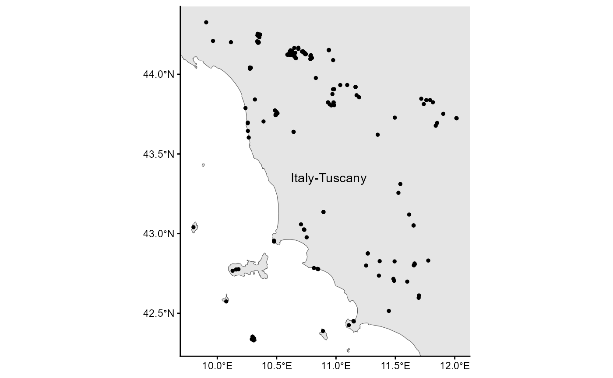
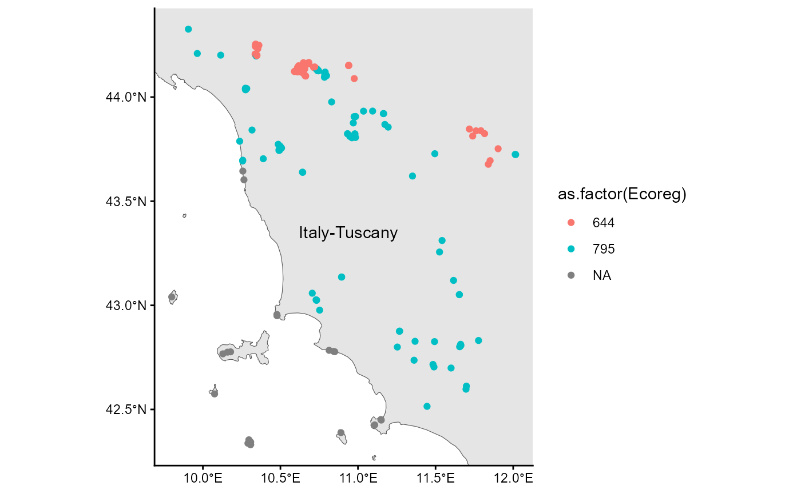

# RESY tutorial

This vignette illustrates a common use of the package: to classify
European vegetation surveys to **EUNIS habitat types**
([FloraVeg.EU](https://floraveg.eu/); Chytrý et
al. [2024](https://doi.org/10.1111/avsc.12798); European Environment
Agency EUNIS [Website](https://eunis.eea.europa.eu/index.jsp)) according
to the **Expert System (ESy)** of Chytrý et
al. ([2020](https://doi.org/10.1111/avsc.12519)) (see
[FloraVeg.EU](https://floraveg.eu/habitat/)). The function
[`prepare_eunis()`](https://loe.gitlab.uni-rostock.de/publications/r-esy/reference/prepare_eunis.md)
incorporates several functions to collect geographic information about
the vegetation survey like the country, ecoregion, or coastal position.
Furthermore, the format of the coordinates and the taxonomy are checked
and adjusted to the requirements for the expert system (ESy). The
function
[`resy_classify()`](https://loe.gitlab.uni-rostock.de/publications/r-esy/reference/resy_classify.md)
does the classification of the vegation surveys including the sites
data.

1.  **Prepare the format** of the sites including the right
    **coordination system** and add information like **ecoregion**,
    **country** or if it is on a **coast**.
2.  **Check of taxonomy** of the species data
3.  Evaluation of your vegetation surveys and **assigning EUNIS habitat
    types**
4.  **Present the results**

## Example

The following R packages are required to run the example of this
vignette:

``` r

library(readr)
library(dplyr)
library(ggplot2)
library(sf)
library(RESY)
```

### Load the example data.

The example data include the species data with the vegetation surveys
and the sites data with further information to the location of the
surveys.

First, the vegetation surveys:

``` r

data_species <- read_csv(
  system.file("extdata", "data_example_species.csv", package = "RESY")
  )
data_species
#> # A tibble: 3,580 × 4
#>     ...1 RELEVE_NR cover species                                             
#>    <dbl> <chr>     <dbl> <chr>                                               
#>  1     1 HU32        0.1 Dryopteris filix-mas (L.) Schott                    
#>  2     2 HU32        0.1 Cephalanthera longifolia (L.) Fritsch               
#>  3     3 HU32        0.5 Prenanthes purpurea L.                              
#>  4     4 HU32        0.5 Anemone nemorosa L.                                 
#>  5     5 HU32        0.5 Epipactis helleborine (L.) Crantz subsp. helleborine
#>  6     6 HU32        0.5 Sorbus aucuparia L. subsp. aucuparia                
#>  7     7 HU32       87.5 Fagus sylvatica L.                                  
#>  8     8 HU32        3   Rubus hirtus Waldst. & Kit.                         
#>  9     9 HU32        3   Abies alba Mill.                                    
#> 10    10 HU32        3   Oxalis acetosella L.                                
#> # ℹ 3,570 more rows
```

Second, the sites data:

``` r

data_sites <- read_csv(
   system.file("extdata", "data_example_sites.csv", package = "RESY")
   ) |>
   select(-"cover") |>
   st_as_sf(coords = c("Longitude", "Latitude"), crs = 4326)
data_sites
#> Simple feature collection with 200 features and 2 fields
#> Geometry type: POINT
#> Dimension:     XY
#> Bounding box:  xmin: 9.809499 ymin: 42.32483 xmax: 12.08963 ymax: 44.32464
#> Geodetic CRS:  WGS 84
#> # A tibble: 200 × 3
#>     ...1 RELEVE_NR            geometry
#>  * <dbl> <chr>             <POINT [°]>
#>  1     1 JZ37       (9.93798 44.32464)
#>  2     2 FR49      (11.09287 43.91546)
#>  3     3 PT45      (11.65339 43.09104)
#>  4     4 ZH63      (10.53301 43.73897)
#>  5     5 TF93      (10.40239 44.23978)
#>  6     6 KG68      (10.40203 44.24087)
#>  7     7 QJ27       (10.40635 44.2413)
#>  8     8 JN90      (10.40602 44.24296)
#>  9     9 ZM18      (10.66071 44.12734)
#> 10    10 BQ20       (10.6589 44.12456)
#> # ℹ 190 more rows
```

### Map

The vegetation surveys of the example dataset are in Tuscany in Italy.



We see a part of Italy, mainly Tuscany and the Mediterranean or more
specific the Tyrrhenian Sea. The dots are the locations of the
vegetation surveys. Some are on islands.

## Preparation for classification

### Apply `prepare_eunis()`

First, we have to prepare the sites and the species data with
[`prepare_eunis()`](https://loe.gitlab.uni-rostock.de/publications/r-esy/reference/prepare_eunis.md)

``` r

outcome <- RESY::prepare_eunis(
   data = data_sites,
   source_crs = 25832,
   run_taxonomy = TRUE,
   species_data = data_species,
   run_coast_dunes = TRUE,
   coast_buffer = 5000
   )
#> Warning in RESY::prepare_eunis(data = data_sites, source_crs = 25832,
#> run_taxonomy = TRUE, : The column 'Altitude (m)' is missing.
#> Warning in RESY::prepare_eunis(data = data_sites, source_crs = 25832,
#> run_taxonomy = TRUE, : NAs in 'Ecoreg' after spatial lookup.
#> Warning in RESY::prepare_eunis(data = data_sites, source_crs = 25832,
#> run_taxonomy = TRUE, : NAs in 'Country' after spatial lookup.
#> Warning: attribute variables are assumed to be spatially constant throughout
#> all geometries
#> Warning: attribute variables are assumed to be spatially constant throughout
#> all geometries
outcome_sites <- tibble(outcome$sites)
outcome_species <- tibble(outcome$species)
```

We have three warnings: The column `Altitude (m)` is missing and this
could not be covered by
[`prepare_eunis()`](https://loe.gitlab.uni-rostock.de/publications/r-esy/reference/prepare_eunis.md),
but we provide a `vignette("altitude")`. `NAs` are in the

ecoregions (`Ecoreg`) and country (`Country`) columns. This could be the
vegetation surveys on islands which is not covered by the base map.

### Additional info of ecoregions and countries

Here are the additional information of ecoregions and countries which
were successfully identified:

``` r

outcome_sites
#> # A tibble: 200 × 9
#>    RELEVE_NR Coast_EEA Dunes_Bohn Ecoreg Ecoreg_name          Country Country_ID
#>    <chr>     <chr>     <chr>       <dbl> <chr>                <chr>   <chr>     
#>  1 JZ37      N_COAST   N_DUNES       795 Italian sclerophyll… Italy   IT        
#>  2 FR49      N_COAST   N_DUNES       795 Italian sclerophyll… Italy   IT        
#>  3 PT45      N_COAST   N_DUNES       795 Italian sclerophyll… Italy   IT        
#>  4 ZH63      N_COAST   N_DUNES       795 Italian sclerophyll… Italy   IT        
#>  5 TF93      N_COAST   N_DUNES       644 Appenine deciduous … Italy   IT        
#>  6 KG68      N_COAST   N_DUNES       644 Appenine deciduous … Italy   IT        
#>  7 QJ27      N_COAST   N_DUNES       644 Appenine deciduous … Italy   IT        
#>  8 JN90      N_COAST   N_DUNES       644 Appenine deciduous … Italy   IT        
#>  9 ZM18      N_COAST   N_DUNES       644 Appenine deciduous … Italy   IT        
#> 10 BQ20      N_COAST   N_DUNES       644 Appenine deciduous … Italy   IT        
#> # ℹ 190 more rows
#> # ℹ 2 more variables: Longitude <dbl>, Latitude <dbl>
```

### Missing info

Let us see which vegetation surveys could not get an ecoregion and
country:

``` r

outcome_sites |>
   filter(is.na(Ecoreg))
#> # A tibble: 23 × 9
#>    RELEVE_NR Coast_EEA Dunes_Bohn Ecoreg Ecoreg_name Country Country_ID
#>    <chr>     <chr>     <chr>       <dbl> <chr>       <chr>   <chr>     
#>  1 OR48      MED_COAST N_DUNES        NA NA          NA      NA        
#>  2 EQ56      MED_COAST N_DUNES        NA NA          NA      NA        
#>  3 IS69      MED_COAST N_DUNES        NA NA          NA      NA        
#>  4 JP48      MED_COAST N_DUNES        NA NA          NA      NA        
#>  5 MF17      MED_COAST N_DUNES        NA NA          NA      NA        
#>  6 SA50      MED_COAST N_DUNES        NA NA          NA      NA        
#>  7 DR59      MED_COAST N_DUNES        NA NA          NA      NA        
#>  8 QI21      MED_COAST N_DUNES        NA NA          NA      NA        
#>  9 PK58      MED_COAST N_DUNES        NA NA          NA      NA        
#> 10 OY37      MED_COAST N_DUNES        NA NA          NA      NA        
#> # ℹ 13 more rows
#> # ℹ 2 more variables: Longitude <dbl>, Latitude <dbl>
```

Species on the coast (‘MED_COAST’) often have `NAs` for ecoregion and
country. This has to be corrected by yourself.

Here is the updated map with ecoregions as differetn colors



### Checked species names

Let’s have a look on the checked and transformed species names. There
are for example no author names anymore:

``` r

outcome_species
#> # A tibble: 3,580 × 6
#>     ...1 RELEVE_NR cover species                      Name_matched Accepted_name
#>    <dbl> <chr>     <dbl> <chr>                        <chr>        <chr>        
#>  1     1 HU32        0.1 Dryopteris filix-mas (L.) S… Dryopteris … Dryopteris f…
#>  2     2 HU32        0.1 Cephalanthera longifolia (L… Cephalanthe… Cephalanther…
#>  3     3 HU32        0.5 Prenanthes purpurea L.       Prenanthes … Prenanthes p…
#>  4     4 HU32        0.5 Anemone nemorosa L.          Anemone nem… Anemonoides …
#>  5     5 HU32        0.5 Epipactis helleborine (L.) … Epipactis h… Epipactis he…
#>  6     6 HU32        0.5 Sorbus aucuparia L. subsp. … Sorbus aucu… Sorbus aucup…
#>  7     7 HU32       87.5 Fagus sylvatica L.           Fagus sylva… Fagus sylvat…
#>  8     8 HU32        3   Rubus hirtus Waldst. & Kit.  Rubus hirtus Rubus hirtus 
#>  9     9 HU32        3   Abies alba Mill.             Abies alba   Abies alba   
#> 10    10 HU32        3   Oxalis acetosella L.         Oxalis acet… Oxalis aceto…
#> # ℹ 3,570 more rows
```

## Classify the vegetation surveys to EUNIS habitat types

### Preparation

Load the expert file which is the base for the evaluation.

``` r

# paths <- RESY::resy_example_paths()
# RESY::resy_validate_expert_txt(paths$expertfile_txt)
# ex    <- RESY::resy_read_example_data()
```

### Apply `resy_classify()`

Now, you can classify your vegetation surveys (`obs`) which includes
sites data (`header`).

``` r

# res   <- RESY::resy_classify(ex$obs, ex$header, paths$expertfile_json, id_col = 'PlotObservationID')
```

### Print the results

``` r

# print(table(res$result.classification))
# resy_eval_plot(res, '100')
# 
# resy_candidates(res)
# resy_candidates(res, plot_id = "1")
# resy_candidates(res, min_priority = 4) # only assignments with at least priority 4
```

## References

Chytrý M, Řezníčková M, Novotný P et
al. ([2024](https://doi.org/10.1111/avsc.12798)) FloraVeg.EU – an online
database of European vegetation, habitats and flora. – *Applied
Vegetation Science* 27, e12798. <https://doi.org/10.1111/avsc.12798>

Bruelheide H, Tichý L, Chytrý M, Jansen F
([2021](https://doi.org/10.1111/avsc.12562)) Implementing the formal
language of the vegetation classification expert systems (ESy) in the
statistical computing environment R. – *Applied Vegetation Science* 24,
e12562 <https://doi.org/10.1111/avsc.12562>

Chytrý M, Tichý L, Hennekens SM et
al. ([2020](https://doi.org/10.1111/avsc.12519)) EUNIS Habitat
Classification: expert system, characteristic species combinations and
distribution maps of European habitats. – *Applied Vegetation Science*
23, 648–675. <https://doi.org/10.1111/avsc.12519>

Mucina L, Bültmann H, Dierßen K et
al. ([2016](https://doi.org/10.1111/avsc.12257)) Vegetation of Europe:
hierarchical floristic classification system of vascular plant,
bryophyte, lichen, and algal communities. – *Applied Vegetation Science*
19(Suppl. 1), 3–264.<https://doi.org/10.1111/avsc.12257>
