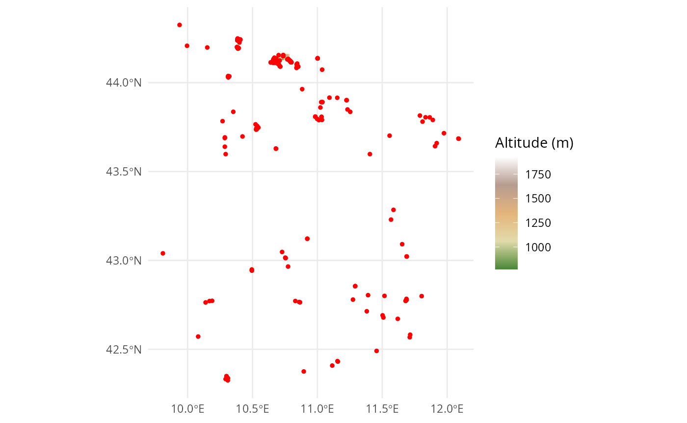

# Altitude data

This vignette illustrates how you can get altitude data for the wrapper
function `check_eunis`. Since the altitude data for Europe is too big
for a R package, you have to get it on your own.

## Example

First, we illustrate the altitude data for our example dataset.

``` r

library(tidyverse)
library(here)
library(sf)
library(terra)
library(tidyterra)
```

### Load the example data

Load the altitude data for the area of our example.

``` r

altitude <- terra::rast(
  system.file("extdata", "data_example_altitude.tif", package = "RESY")
)
altitude
#> class       : SpatRaster
#> size        : 63, 168, 1  (nrow, ncol, nlyr)
#> resolution  : 0.0005555556, 0.0005555556  (x, y)
#> extent      : 10.69171, 10.78504, 44.12662, 44.16162  (xmin, xmax, ymin, ymax)
#> coord. ref. : lon/lat WGS 84 (EPSG:4326)
#> source      : data_example_altitude.tif
#> name        : eurodem
#> min value   :     771
#> max value   :    1927
```

We load the example plots.

``` r

data_sites <- readr::read_csv(
  system.file("extdata", "data_example_sites.csv", package = "RESY"),
  show_col_types = FALSE
) |>
  dplyr::select(PlotObservationID, Longitude, Latitude) |>
  sf::st_as_sf(coords = c("Longitude", "Latitude"), crs = 4326) |>
  sf::st_transform(terra::crs(altitude))
```

### Map

We show the map with altitude data and the plots

``` r

ggplot() +
  tidyterra::geom_spatraster(data = altitude) +
  tidyterra::scale_fill_whitebox_c(
    palette = "high_relief",
    na.value = "lightblue"
    ) +
  geom_sf(data = data_sites, color = "red", size = 1) +
  labs(fill = "Altitude (m)") +
  theme_minimal()
```



© EuroGeographics 2026, Istituto Geografico Militare (IGM), Italy;
[Licence](https://www.mapsforeurope.org/licence)

``` r

altitude_values <- terra::extract(altitude, terra::vect(data_sites))
data_sites <- data_sites |>
  mutate("Altitude (m)" = altitude_values$eurodem)
data_sites
#> Simple feature collection with 200 features and 2 fields
#> Geometry type: POINT
#> Dimension:     XY
#> Bounding box:  xmin: 9.809499 ymin: 42.32483 xmax: 12.08963 ymax: 44.32464
#> Geodetic CRS:  WGS 84
#> # A tibble: 200 × 3
#>    PlotObservationID            geometry `Altitude (m)`
#>  * <chr>                     <POINT [°]>          <dbl>
#>  1 JZ37               (9.93798 44.32464)             NA
#>  2 FR49              (11.09287 43.91546)             NA
#>  3 PT45              (11.65339 43.09104)             NA
#>  4 ZH63              (10.53301 43.73897)             NA
#>  5 TF93              (10.40239 44.23978)             NA
#>  6 KG68              (10.40203 44.24087)             NA
#>  7 QJ27               (10.40635 44.2413)             NA
#>  8 JN90              (10.40602 44.24296)             NA
#>  9 ZM18              (10.66071 44.12734)             NA
#> 10 BQ20               (10.6589 44.12456)             NA
#> # ℹ 190 more rows
```

## Crop your own altitude data

Download the elevation data from EuroDEM (European Digital Elevation
Model) from <https://www.mapsforeurope.org/datasets/euro-dem> which is
from EuroGeographics and the project is cofounded by the European Union.

### Load and adapt EuroDEM data

Save it in your data folder of your R project with your coordinates of
your vegetation surveys (sites).

``` r

# altitude <- terra::rast(
#   here::here("data", "euro-dem-tif", "data", "eurodem.tif")
# )
```

EuroDEM is in arcseconds and we have to rescale it to degrees.

``` r

# e <- terra::ext(altitude)
# terra::ext(altitude) <- terra::ext(
#   e[1] / 3600, e[2] / 3600, e[3] / 3600, e[4] / 3600
# )
```

The altitude data needs the right coordination system: EPSG:4258 -
ETRS89 (European Terrestrial Reference System 1989) in degrees.

``` r

# terra::crs(altitude) <- "EPSG:4258"  # geographic ETRS89, degrees
```

Get an overview of the status of the EuroDEM data.

``` r

# altitude
```

### Load example sites

Now, we can load the sites data and transform it to an sf object and
align the CRS to the raster altitude data.

``` r

# data_sites <- readr::read_csv(
#   here::here("data", "data_example_sites.csv", package = "RESY"),
#   show_col_types = FALSE
# ) |>
#   sf::st_as_sf(coords = c("Longitude", "Latitude"), crs = 4326) |>
#   sf::st_transform(terra::crs(altitude))
```

### Crop and save altitude data

We can crop the altitude data to the region of our plots.

``` r

# altitude_cropped <- data_sites |>
#   sf::st_buffer(0.5) |> # degrees now, ~50 km
#   sf::st_bbox() |>
#   terra::crop(x = altitude, y = _) |>
#   terra::project("EPSG:4326")
```

Save the smaller file for a latter use.

``` r

# terra::writeRaster(
#   altitude_cropped,
#   here::here("data", "data_example_altitude.tif"),
#   overwrite = TRUE
# )
```
